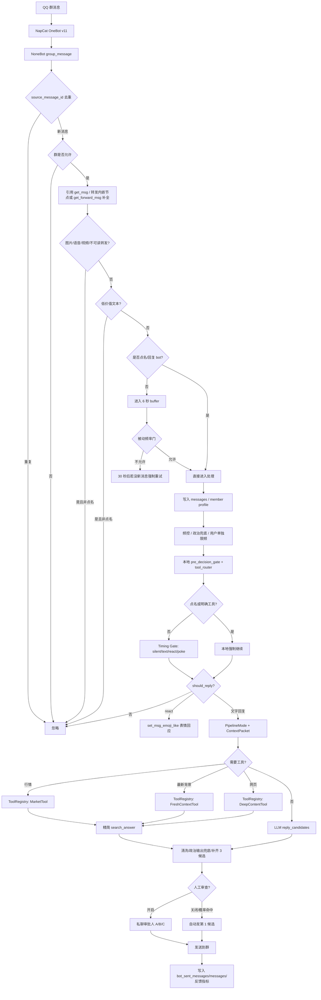

# QQ Social Agent 工程交接文档

本文档给未来接手本项目的 AI / 开发者使用。目标是快速理解：这个 QQ 机器人怎么跑、消息怎么流动、Prompt 在哪里、哪些模块能改、哪些地方不要乱动。

最后更新：2026-07-14

## 1. 项目定位

这是一个本地/服务器可运行的 QQ 群聊社交机器人。

核心目标不是做“问答助手”，而是让人格“张风雪”像群友一样参与指定 QQ 群：

- NapCat / OneBot v11 负责接入 QQ。
- NoneBot2 接收群聊和私聊事件。
- 本地后端先做硬拦截、buffer、频控、上下文整理。
- 本地工具路由先识别搜索/行情/学术查询，轻量 Timing Gate 只判断是否冒泡以及基本社交意图。
- LLM 生成 3 条候选回复。
- 私聊审批人选择 A/B/C 后，后端再发到群里。
- 记忆、画像、黑话、风格、审批反馈会写入 SQLite，后续生成时选择性注入。

当前主要群：

```text
1026813421
```

当前普通私聊白名单见 `config.yaml` 和运行时 DB；`1535071184` 是命令/工具管理员，不走普通私聊生成。

## 2. 服务器建议

本项目不需要 GPU。LLM 走外部 API，服务器只跑 QQ/NapCat、NoneBot、SQLite 和少量 HTTP 查询。

推荐配置：

```text
2 核 CPU
4GB RAM
40GB+ SSD
Ubuntu 22.04 / 24.04
Docker / Docker Compose
```

最低可用配置：

```text
2 核 CPU
2GB RAM
40GB SSD
```

不建议 1GB RAM。NapCat + QQ + Python 后端 + SQLite 长期运行会比较紧。

### 2.1 阿里云/腾讯云价格参考

价格随活动变化很快，下单时以购买页最终价格为准。

腾讯云：

- 腾讯云 Lighthouse 官方产品页常规规格显示：2C2G/40G/3Mbps 为 459 元/年，2C4G/100G/7Mbps 为 1020 元/年。[腾讯云 Lighthouse](https://cloud.tencent.com/product/lighthouse)
- 腾讯云开发者社区 2026 活动文章提到个人新用户有 4C4G 38 元/年、OpenClaw 4C4G 99 元/年、老用户同价续费 99 元/年等活动，但这类活动有身份、首单、库存和时段限制。[腾讯云活动参考](https://cloud.tencent.com/developer/article/2657565)

阿里云：

- 阿里云开发者社区 2026 文章提到轻量应用服务器活动价：2C2G 38 元/年，2C4G 199 元/年，2C4G 也有 9.9 元/月体验价。[阿里云活动参考](https://developer.aliyun.com/article/1724308)
- 同类文章还提到 ECS 经济型 2C2G 99 元/年、u1 2C4G 199 元/年，但企业/新老用户/续费规则需要看当时活动页。

实用建议：

```text
优先级 1：阿里云/腾讯云轻量 2C4G 年付活动机，价格能到 199 元/年以内就很合适。
优先级 2：国内云 2C2G 年付活动机，价格 38-99 元/年可以试跑，但长期更建议 4GB。
优先级 3：海外 VPS 2C4G，比如 Hetzner / RackNerd，便宜但 QQ 登录风控和网络稳定性要观察。
```

服务器安全要求：

- NapCat WebUI 不要直接暴露公网，最好用防火墙限制 IP 或 SSH tunnel。
- OneBot WebSocket `8080` 不要开放公网，只允许本机/内网访问。
- `.env`、`data/bot.sqlite3`、NapCat 登录态必须备份。
- 不要频繁迁移服务器 IP，QQ 登录可能风控。

## 3. 目录结构

```text
/opt/qq-social-agent
├── bot.py                         # NoneBot 入口
├── config.yaml                    # 运行配置、模型路由、群/私聊白名单、频控
├── prompts/zhangfengxue.yaml      # 集中 Prompt：人格、决策、回复、记忆、风格学习
├── qq_social_agent/
│   ├── plugin.py                  # 主插件：事件入口、群聊流程、审批、工具单、学习调度
│   ├── onebot_gateway.py          # NapCat / OneBot API 薄封装
│   ├── group_directory.py         # 群资料和群成员同步
│   ├── history_sync.py            # 群历史补全、引用消息 get_msg 补全
│   ├── social_actions.py          # 表情回应等非文字社交动作和限频
│   ├── message_segments.py        # OneBot 消息段统一解析、文件/卡片安全元数据
│   ├── media_context.py           # 图片理解/OCR、文件元数据补全
│   ├── notice_events.py           # notice 事件归一化和结构化事件记忆
│   ├── observability.py           # correlation id、OneBot 活跃/错误状态
│   ├── deepseek_client.py         # LLM 客户端：多 provider 路由、JSON 解析、各流程调用
│   ├── memory.py                  # SQLite 存储：消息、去重、群目录、记忆、画像、反馈、指标、用量
│   ├── rag_store.py               # 轻量 RAG 的证据文档、FTS5、向量和检索日志存储
│   ├── rag_indexer.py             # 将原消息、摘要、记忆原子、画像、黑话、反馈增量索引
│   ├── embedding_client.py        # 硅基流动 embedding 客户端
│   ├── rag_router.py              # 判断何时只全文检索、何时追加语义检索
│   ├── rag_retriever.py           # 混合召回、证据过滤、上下文预算和后台向量任务
│   ├── rag_admin.py               # 私聊 RAG 状态、反馈、评测和知识库管理控制器
│   ├── pipeline_types.py          # PipelineState / ContextPacket / ToolRequest / ToolResult
│   ├── pipeline_stages.py         # 决策、上下文、生成、审批、发送的状态迁移
│   ├── temporal_evidence.py       # 当前/历史意图、证据性质、时间与明确冲突降权
│   ├── reference_resolver.py      # 他/她/后来呢等轻量上下文指代消解
│   ├── context_assembler.py       # 按 chat/search/market/deep_url 模式组装和预算上下文
│   ├── timing_gate.py             # silent/text/react/poke 和五类基本社交意图
│   ├── tool_router.py             # 搜索/行情/网页确定性路由、连续检索主题继承与审计
│   ├── tool_registry.py           # 统一工具注册和结构化执行结果
│   ├── approval_models.py         # 审批候选与待审批单数据模型
│   ├── delivery.py                # 回复切分、延迟回复强制艾特等发送计划
│   ├── background_learning.py     # 单工作者后台学习调度，避开回复热路径
│   ├── config.py                  # 读取 config.yaml，构造模型 route/provider
│   ├── persona.py                 # 从 prompt yaml 读取 persona
│   ├── prompts.py                 # 从 prompt yaml 读取 flows/action_guides
│   ├── decision_gate.py           # LLM 前本地预决策、低价值文本、行情硬触发
│   ├── approval_rules.py          # 审批单、工具单、命令正则和帮助文本
│   ├── group_jargon.py            # 内置群黑话词典
│   ├── cue_patterns.py            # 旧 cue 分类器；不再用于拒答或改写 action
│   ├── political_guard.py         # 中国政治红线兜底
│   ├── rate_limiter.py            # 发言频控
│   ├── reply_splitter.py          # 长回复拆成多条 QQ 消息
│   └── tools/
│       ├── market_intent.py       # 股票/加密货币意图识别
│       ├── market.py              # Yahoo Finance / CoinGecko 行情工具
│       └── fresh_context.py       # Tavily / Google News / Bing Web 搜索与事实包
├── scripts/
│   ├── start_bot_daemon.sh        # 后台启动 bot
│   ├── stop_bot.sh                # 停止 bot
│   ├── restart_bot.sh             # 重启 bot
│   ├── status.sh                  # 查看端口、模型、NapCat 状态
│   └── start_napcat.sh            # 启动 NapCat/QQ 入口
├── tests/                         # pytest 测试
├── data/bot.sqlite3               # 运行数据和长期记忆，重要
└── logs/bot-runtime.log           # 后台日志
```

## 4. 启动和运行

主要开发和生产环境均位于服务器：

```bash
cd /opt/qq-social-agent
```

查看状态：

```bash
scripts/status.sh
docker compose -p qq-social-agent -f docker-compose.server.yml ps
```

修改 Python 代码后，重新构建并启动 bot，不动 NapCat：

```bash
scripts/restart_bot.sh
```

只修改挂载的 Prompt 文件时，不需要重新构建镜像，但要重启 bot 让进程重新读取：

```bash
docker compose -p qq-social-agent -f docker-compose.server.yml restart bot
```

只启动现有 bot 镜像：

```bash
scripts/start_bot_daemon.sh
```

停止 bot：

```bash
scripts/stop_bot.sh
```

查看日志：

```bash
docker compose -p qq-social-agent -f docker-compose.server.yml logs -f bot
docker compose -p qq-social-agent -f docker-compose.server.yml logs -f napcat
```

除非 QQ 登录或连接损坏，不要重启 NapCat。重启 NapCat 可能要求重新扫码并触发 QQ 风控；确需启动时才显式运行 `scripts/start_napcat.sh`。

## 5. 环境变量和密钥

`.env` 不要提交。

当前代码按 provider 从环境变量取 key：

```env
DEEPSEEK_API_KEY=...
SILICONFLOW_API_KEY=...
TAVILY_API_KEY=...
FRESH_SEARCH_PROVIDER=auto
SUPERUSERS=["..."]
```

`config.yaml` 只记录 provider、base URL、模型名、env var 名，不应该写真实 API key。

## 6. 模型路由

模型路由在 `config.yaml`：

```yaml
deepseek:
  providers:
    deepseek:
      base_url: https://api.deepseek.com
      api_key_env: DEEPSEEK_API_KEY
      thinking: disabled
    siliconflow:
      base_url: https://api.siliconflow.cn/v1
      api_key_env: SILICONFLOW_API_KEY
      thinking: disabled
  decision_model: siliconflow/Qwen/Qwen3.5-35B-A3B
  reply_model: siliconflow/MiniMaxAI/MiniMax-M2.5
  jargon_model: siliconflow/Qwen/Qwen3.5-35B-A3B
  memory_model: siliconflow/Qwen/Qwen3.5-35B-A3B
  style_model: siliconflow/MiniMaxAI/MiniMax-M2.5
  member_profile_model: siliconflow/MiniMaxAI/MiniMax-M2.5
```

路由含义：

| route | 用途 |
| --- | --- |
| `decision` | 群聊是否插嘴、action、是否需要最新背景 |
| `reply` | 私聊单条回复、群聊三候选、每日复盘 |
| `jargon` | 黑话词典注入选择 |
| `memory` | 中期记忆压缩、长消息摘要 |
| `style` | 群聊表达风格学习 |
| `member_profile` | 群友画像总结 |

运行时也能通过 QQ 私聊工具单切模型，覆盖值存在 SQLite 的 `app_kv`，重启后仍生效。清除覆盖命令：`清模型覆盖`。

`deepseek_client.py` 会按主路由调用；主 provider 失败时尝试 `fallback_models`。

## 7. Prompt 管理

集中 Prompt 文件：

```text
/opt/qq-social-agent/prompts/zhangfengxue.yaml
```

重要区域：

```yaml
persona:
  decision_prompt: ...  # 决策层看到的人格摘要
  prompt: ...           # 回复/候选/复盘看到的完整人格

action_guides:
  reply: ...
  answer: ...
  care: ...

flows:
  decision:             # LLM 是否回复/action 判断
  jargon_select:        # 选黑话
  reply:                # 私聊/兜底单条回复
  reply_candidates:     # 群聊三候选
  daily_review:         # 午夜 24h 复盘
  member_profile:       # 群友画像
  long_message_summary: # 长消息压缩
  mid_memory:           # 中期记忆
  style_learning:       # 风格学习
```

修改 Prompt 后必须重启后端才会重新读取。

注意：

- 不要把密钥、隐藏配置、真实内部实现塞进人格 prompt。
- action 名字要和 `deepseek_client.py` 的 `SOCIAL_ACTIONS` 对齐。
- 如果新增 flow，需要同时改 `PromptRegistry` 使用点和测试。
- 决策层 prompt 不宜塞太多完整人格，否则每条消息 token 成本高。

## 8. 群聊消息主流程

主入口：`qq_social_agent/plugin.py`

群消息处理函数：

```text
handle_group_message()
_handle_group_message_locked()
```

流程图：



### 8.1 前置硬拦截

文件：`decision_gate.py` 和 `plugin.py`

当前职责边界：

- `decision_gate.py` 处理点名、低价值消息和明确行情等确定性规则。
- `tool_router.py` 独立判断是否需要搜索、行情、网页等工具；明确工具意图不进入 Timing Gate。
- `timing_gate.py` 不看长期记忆、不选择工具，只决定 `silent/text/react/poke` 和 `answer/care/play/agree/chat`。
- 每条入站消息只有一份 `PipelineState`；它保存来源、模式、输出通道、社交意图、工具请求/结果、`ContextPacket`、候选、审批 ID、发送消息 ID、失败原因和阶段耗时。审批单携带同一对象进入发送阶段。
- `ToolRegistry` 已统一注册搜索、行情和深度网页读取；shadow 指标只用于和旧判断做兼容审计，不再控制执行。
- 只有确定生成文字后，`context_assembler.py` 才组装上下文；普通聊天保留分层记忆，搜索/行情/网页模式主动排除旧摘要、画像、风格和原文语料，避免覆盖新事实。
- 明确搜索、行情评论和网页阅读使用单候选 `search_answer` 与独立快速模型路由；“帮我研究研究”等连续追问会继承最近一条真实群友问题。

OneBot 扩展入口：

- `onebot_gateway.py`：集中调用 OneBot API，统一超时和耗时/错误统计；包含群目录、历史、引用、转发、`get_file` 和表情回应。
- `group_directory.py`：bot 连接后同步群信息和群成员，写入 `group_info` / `group_members`。
- `history_sync.py`：bot 连接后补最近群历史；引用消息缺正文时用 `get_msg` 补原消息。
- `social_actions.py`：`action=react` 时只点表情，不发文字，并做群/用户/小时限频。
- `message_segments.py` 统一解析图片/商城表情、文件、音乐、分享、位置、小程序、语音和视频；`content_ingestion.py` 在点名/明确请求时受限读取文件正文和转写语音。
- `media_context.py` 使用 SiliconFlow `deepseek-ai/DeepSeek-OCR` 做图片文字与画面简述；商城动画表情默认不烧 OCR。
- notice 会结构化写入指标库；进退群、群名片等变更会触发群目录刷新。
- `/healthz` 检查进程/数据库，`/readyz` 检查数据库/LLM/OneBot，`/status` 提供搜索、网关、OCR、审批和错误摘要。

不进 LLM 的典型情况：

- 非点名且 OCR 没识别出文字的纯图片、语音、视频、不可读转发。
- 非点名低价值文本：`6`、`哈哈`、`嗯`、`好好好`、`绷`、`没绷住` 等。
- 群未启用。
- 频控/单用户限频。
- 非点名命中政治红线。
- 低价值地回复 bot 旧消息，比如只回“好的”。

低价值词表在：

```text
qq_social_agent/decision_gate.py
LOW_VALUE_GROUP_TEXTS
```

### 8.2 Buffer 和被动频率门

关键常量在 `plugin.py`：

```python
GROUP_BUFFER_SECONDS = 6.0
GROUP_PASSIVE_DECISION_GAP_SECONDS = 30
GROUP_PASSIVE_DECISION_EVERY_MESSAGES = 3
```

含义：

- 非点名群消息先攒 6 秒，避免每条都打 LLM。
- 如果 30 秒内一直有人说话，则每 3 条普通消息才进一次 decision。
- 如果 30 秒内没有新消息，则挂起的消息会强制进入一次 decision。
- LLM 正在生成候选时，新消息先继续等待，不并发启动第二个生成。

### 8.3 点名和回复

以下是强信号：

- QQ @ bot。
- QQ 直接回复 bot。
- 消息文本提到 `张风雪` 或 `风雪`。

回复消息会被格式化成更清楚的上下文，避免 bot 把 A/B 关系弄混：

```text
B[#尾号]回复A[#尾号]消息【A说：...；B回复A：...】
```

如果 A 是 bot，会额外提示：

```text
张风雪和风雪都是你自己
```

### 8.4 轻量混合 RAG

- 每次检索按群隔离，先走 SQLite FTS5；明确回忆、人物过去、QQ 号或知识库问题再追加 BGE-M3 语义向量。
- 群聊原文、阶段摘要、`memory_atoms` 和群友画像进入同一个重排器；人物别名会先解析成 QQ，排序综合关键词、语义、人物参与者、证据置信度、文档类型和人工反馈。
- `config.yaml -> rag.member_aliases` 保存需要明确消歧的群内称呼；当前“小鸟”固定指向 `184589072`。“小时候”不是历史检索触发词。
- 点名/明确要求后成功读取的 txt/PDF/docx 和网页会按来源分块写成 `file_knowledge` / `web_knowledge`，不会跨群检索，也不会执行文档或网页中的指令。
- Trace 的 `rag` 阶段展示 route、解析到的人物、命中文档 ID/类型/得分/排序原因/证据来源。
- 私聊工具命令：`RAG状态`、`RAG测试 问题`、`RAG反馈 相关|不相关|错人|过期 序号`、`RAG评测`、`RAG评测列表`、`RAG评测添加 问题 | 关键词 | QQ`。
- `RAG知识库` 查看文件/网页来源和版本；`RAG知识库删除 ID` 软删除来源；`RAG知识库重建 ID` 重建全文与向量索引。同一群内相同内容不会重复建库，更新来源会保留旧版本审计但只检索新版本。
- 评测用例是可重复运行的小型回归集，输出 Recall@K、平均延迟和 P95；反馈只调整后续排序，不删除原始证据。
- 源数据同步由后台 worker 使用独立 SQLite 连接增量执行；消息回复中的 `retrieve()` 只发同步信号，不再内联重建索引。
- 群友画像索引只保留每人的当前快照可检索，旧快照仍留在源表中用于审计。
- 检索证据区分“群友当时陈述、历史摘要、结构化事实、阶段画像和文件/网页资料”；问“现在”时新证据获得时间加权，只有同一人物、同一主题出现明确肯定/否定变化时旧证据才会标记“较新反证降权”。问“以前/当时”不会用新鲜度覆盖历史。
- “他/她/这个人/那后来呢”等只在能够从最近对话唯一解析人物时扩展检索查询；无法唯一确认时不强绑人物，也不额外调用 LLM。

## 9. 审批机制

审批逻辑在：

```text
qq_social_agent/plugin.py
qq_social_agent/approval_rules.py
```

核心对象：

```python
PendingGroupApproval
PendingApprovalCandidate
```

审批人：

- 主人：`1535071184`
- 默认基础审批人：`3370998238`
- 测试号/工具管理员：`2776760548`

权限：

- 基础审批人只能 A/B/C/D/X/1/2/3/取消。
- 主人/工具管理员可以改模型、黑话、私聊白名单、开关、审批概率、查看统计。

审批命令：

```text
A / 1       发送候选 1
B / 2       发送候选 2
C / 3       发送候选 3
D / X / 取消 不发
A! / 1!     发送并标记优质
不准奏原因：xxx
不准奏B原因：xxx
```

审查开关：

```text
开启审查
关闭审查
审批概率 30
审查状态
```

`审批概率 30` 表示审查开启时，有 30% 概率自动发送第 1 候选，其余仍发审批单。

防串机制：

- 两个审批人谁先处理，候选就被 pop。
- 另一个审批人的旧数字会短时间冷却，避免串到下一条。

## 10. 私聊机制

私聊入口：

```text
handle_private_message()
```

规则：

- 先尝试处理审批/工具命令。
- `1535071184` 是命令专用号，不走普通私聊聊天。
- 普通私聊需要在 `config.yaml` 白名单、运行时白名单或工具管理员隐式允许中。
- `2776760548` 是测试号，支持强服从调试。

强服从命令：

```text
强服从
关闭强服从
强服从状态
强服从：具体调试要求
```

私聊白名单命令：

```text
私聊白名单
加私聊 123456789
删私聊 123456789
```

## 11. 记忆和学习

数据库：`data/bot.sqlite3`

重要表：

| 表 | 用途 |
| --- | --- |
| `messages` | 群聊/私聊消息原文或压缩后的上下文 |
| `memory_summaries` | 中期聊天回想 |
| `style_rules` | 群聊表达风格规则 |
| `member_profiles` | 群友昵称/曾用名 |
| `member_impressions` | 后端统计的群友画像基础数据 |
| `member_profile_summaries` | LLM 生成的群友长期画像摘要 |
| `bot_sent_messages` | bot 已发送消息，用于撤回/反馈/归因 |
| `recalled_reply_feedback` | 不准奏/撤回原因等负反馈 |
| `approved_reply_feedback` | A!/1! 标优反馈 |
| `memory_atoms` | 结构化长期记忆单元 |
| `custom_jargon_entries` | QQ 私聊添加的自定义黑话 |
| `bot_metric_events` | 监控统计事件 |
| `llm_usage_events` | token 统计事件；当前 config 关闭 usage tracking |
| `app_kv` | 运行时开关、模型覆盖、审批人、白名单等 |

### 11.1 短期上下文

`config.yaml`：

```yaml
bot:
  context_limit: 30
```

Timing Gate 只看最近约 14 条消息；回复生成通常取最近 30 条，并按需加入分类型记忆包，不会全量塞历史。

### 11.2 长消息压缩

超过 100 字的消息会先经过 `long_message_summary` 压缩，再进入上下文，避免一条长消息在短期记忆里反复吃 token。

相关常量：

```python
LONG_MESSAGE_SUMMARY_THRESHOLD = 100
LONG_MESSAGE_SUMMARY_SOURCE_LIMIT = 1800
```

### 11.3 中期记忆

`mid_memory` 会把即将离开短期上下文的一批真人聊天压缩成回想。分页不再把 bot 自己的消息计入批次，避免真人消息不足阈值时游标永久停住。

常量：

```python
MID_MEMORY_BATCH_SIZE = 60
MID_MEMORY_MIN_BATCH = 24
MID_MEMORY_KEEP_SUMMARIES = 4
```

生成回复时只注入相关回想，不塞全部。

学习由 `BackgroundLearningCoordinator` 单工作者执行；群聊发言关闭不等于学习关闭，已经入库的消息仍会按游标继续整理。回复/点名任务繁忙时，学习任务会延后。

### 11.4 原文语料库

`memory.relevant_raw_corpus_examples()` 会检索群友原文和前后上下文，用于学习说话节奏、断句、黑话和接话方式。

当前策略：

- 默认注入 6 条相关原文语料。
- 小鸟 `184589072` 有额外加权，最多优先混入 2 条。
- Prompt 明确禁止照搬原文。

### 11.5 群友画像

画像来源两层：

- 后端实时统计：发言数、标签、高频词、近期原话。
- LLM 画像摘要：每天最多一次，用 `member_profile` flow 总结活跃群友。

查看命令：

```text
群友画像 20
```

### 11.6 记忆单元 memory_atoms

用于记录结构化长期事实：

```text
relation / preference / feedback / event / jargon
subject_user_id
object_user_id
content
confidence
importance
expires_at
source
```

查看/修改命令：

```text
记忆单元 20
加记忆：内容
删记忆 123
```

适合写入“谁是谁”“谁和谁有什么关系”“主人偏好”“长期反馈”。

## 12. 工具

### 12.1 行情工具

文件：

```text
qq_social_agent/tools/market_intent.py
qq_social_agent/tools/market.py
```

支持：

- 美股：Yahoo Finance Chart API，失败后 fallback 到 yfinance。
- 加密货币：CoinGecko。
- 每分钟最多 2 次外部查询。
- 每个标的 60 秒缓存。

触发逻辑：

- 后端先识别 ticker/币种，例如 NVDA、TSLA、BTC、ETH。
- 如果文本带有“价格/多少/行情/涨跌/怎么看/怎么了”等明确查询词，本地可直接走 `market_check`。
- LLM decision 也可能返回 `market_check`。

### 12.2 最新背景搜索

文件：

```text
qq_social_agent/tools/fresh_context.py
```

支持：

- Tavily 主搜索；失败后新闻/体育回退 Google News RSS，普通网页回退 Bing RSS。
- `web/news/sports` 三种查询，明确“搜/查/联网看看”在 decision 决定回复后由后端保证真正调用搜索。
- 搜索前会清理 key/token/长 QQ 号；结果带 `[S1]` 编号、来源、日期和 URL，并作为不可信外部数据注入。
- 限频、超时、结果数和各类型缓存 TTL 在 `config.yaml -> fresh_search` 配置；当前每分钟最多 4 次。
- `/status` 可查看 provider、缓存、剩余限额、最近状态、耗时和失败原因，不显示 API key。

原则：

- 普通实时话题仍由 LLM decision 判断是否需要；明确搜索请求只要决定回复，后端会强制联网。
- 搜索结果会压成事实包再给回复模型。
- 回复不能说“我没联网”，只能说“没拿到可靠新消息”。

### 12.3 图片和转发消息感知

当前能力：

- 普通图片会用 DeepSeek-OCR 输出一句画面概括、可见文字和表情包含义，再并入上下文。
- 商城动画表情与普通图片分开，默认只保留表情摘要，避免逐个消耗 OCR。
- 文件、语音、视频、音乐、分享、位置、小程序会保留安全元数据占位；小型 txt/pdf/docx 可受限读取，语音可经 NapCat 转 mp3 后调用硅基流动 ASR。
- 非点名且主要是不可读媒体时，不进入 buffer 和 LLM decision。
- 转发优先读取消息段内嵌 `content/node`，没有内容时再调用 `get_forward_msg`，随后抽取/总结。

当前图片理解依赖外部 DeepSeek-OCR，不做历史图片批量回填；文件/语音只在点名、回复或明确要求时读取，普通群消息不会自动烧接口。

## 13. 政治兜底

文件：

```text
qq_social_agent/political_guard.py
```

作用：

- 输入命中中国国内政治红线时，非点名不插话。
- 点名时返回兜底安全回复。
- 输出候选也会过 `sanitize_political_output()`，命中则替换。

这个模块是硬兜底，不建议用 prompt 替代。

## 14. QQ 工具单

工具单文本在：

```text
qq_social_agent/approval_rules.py
```

入口：

```text
T
bot工具
工具
审批规则详情
```

常用命令：

```text
A1              最近拦截
A2              模型状态
A3              审批人列表
A4              私聊白名单
A5              token 用量
A6              今日统计
B1              近期记忆
B2              风格学习
B3              群友画像
B4              记忆单元
F1              黑话列表
G1              私聊白名单
H1              审批人列表
```

直接命令：

```text
拦截 20
统计 今日
统计 7天
统计 2026-07-11
模型状态
切回复模型 siliconflow/MiniMaxAI/MiniMax-M2.5
清模型覆盖
/黑话：咱妈 指代：中国
/删黑话：咱妈
```

## 15. 常见修改指南

### 15.1 改人格/说话风格

优先改：

```text
prompts/zhangfengxue.yaml
```

常改位置：

- `persona.prompt`
- `persona.decision_prompt`
- `action_guides`
- `flows.reply_candidates.system`
- `flows.decision.system`

改完跑：

```bash
cd /opt/qq-social-agent
.venv/bin/python -m pytest tests/test_config.py tests/test_deepseek_client.py -q
```

然后重启后端。

### 15.2 改是否回复/插嘴频率

看三层：

1. 本地硬拦截：`decision_gate.py`
2. buffer/被动频率门：`plugin.py` 的 `GROUP_BUFFER_SECONDS`、`GROUP_PASSIVE_DECISION_*`
3. LLM 决策 prompt：`prompts/zhangfengxue.yaml` 的 `flows.decision`

不要只改 prompt。很多“不说话”其实是后端拦截或被动频率门。

### 15.3 改审批单/工具单

改：

```text
qq_social_agent/approval_rules.py
```

如新增命令，还要改：

```text
qq_social_agent/plugin.py
_is_private_tool_text()
_handle_group_approval_private()
```

### 15.4 改模型

默认配置改：

```text
config.yaml
```

运行时切换：

```text
模型状态
切决策模型 <完整模型名>
切回复模型 <完整模型名>
切画像模型 <完整模型名>
清模型覆盖
```

如果新增 provider：

1. `config.yaml` 加 `deepseek.providers.<name>`。
2. 设置对应 `api_key_env`。
3. `.env` 添加 key。
4. `model_catalog` 加可选模型。
5. 测试 `tests/test_config.py`。

### 15.5 改记忆逻辑

主要看：

```text
qq_social_agent/memory.py
qq_social_agent/plugin.py
prompts/zhangfengxue.yaml flows.mid_memory/member_profile/style_learning
```

原则：

- 运行数据很重要，不要随便删 `data/bot.sqlite3`。
- schema 变更用 `create table if not exists` 或兼容性 `alter table`。
- 不要写破坏性 migration。
- 需要备份时先复制 DB。

### 15.6 改搜索/行情

搜索：

```text
qq_social_agent/tools/fresh_context.py
```

行情：

```text
qq_social_agent/tools/market.py
qq_social_agent/tools/market_intent.py
```

普通话题不要无脑前置搜索；明确搜索命令由后端保证执行，其他最新背景仍交给 decision，避免浪费额度和把闲聊变成新闻播报。

## 16. 测试

全量测试：

```bash
cd /opt/qq-social-agent
.venv/bin/python -m pytest -q
```

常用局部测试：

```bash
.venv/bin/python -m pytest tests/test_config.py -q
.venv/bin/python -m pytest tests/test_deepseek_client.py -q
.venv/bin/python -m pytest tests/test_plugin_low_value.py -q
.venv/bin/python -m pytest tests/test_memory_store.py -q
.venv/bin/python -m pytest tests/test_market_tool.py tests/test_fresh_context.py -q
```

改 prompt 后至少跑：

```bash
.venv/bin/python -m pytest tests/test_config.py tests/test_deepseek_client.py -q
```

改拦截/频率后至少跑：

```bash
.venv/bin/python -m pytest tests/test_plugin_low_value.py tests/test_scorer.py tests/test_rate_limiter.py -q
```

改工具后至少跑：

```bash
.venv/bin/python -m pytest tests/test_market_tool.py tests/test_market_intent.py tests/test_fresh_context.py -q
```

## 17. Git 和数据

不要提交：

```text
.env
logs/
__pycache__/
*.pyc
```

`data/bot.sqlite3` 是长期记忆和运行状态。用户之前说“数据也是重要的东西”，但提交前必须确认是否要把 DB 提交到 GitHub。默认不要擅自提交数据库，除非用户明确要求。

提交前查看：

```bash
git status --short
git diff --stat
```

推送：

```bash
git add <文件>
git commit -m "<message>"
git push origin main
```

## 18. 当前工程风险和注意点

1. `plugin.py` 仍然较大，但 Pipeline 类型、模式化上下文、Timing Gate、工具路由/注册、审批模型、发送计划和学习调度已经拆出；后续继续拆事件编排本身：
   - `group_flow.py`
   - `private_flow.py`
   - `approval_service.py`
   - `learning.py`
   - `message_format.py`

2. LLM 成本主要来自：
   - 非点名消息的轻量 Timing Gate。
   - reply_candidates 三候选。
   - 长消息摘要。
   - 风格学习/画像/中期记忆。
   - 搜索/行情本身不是 token 大头，但会增加后续 prompt 信息量。

3. 当前 `usage_tracking_enabled: false`，token 报告可能没有新数据。

4. 审批流程依赖私聊，NapCat 私聊失败时群聊候选不会发出去。

5. 图片理解来自 DeepSeek-OCR 的简短画面/OCR输出；它仍可能看错，回复不能把模糊图像细节说成确定事实。

6. Prompt 里例子越具体，模型越可能照搬。优质发言和原文语料只能作为“节奏参考”，不能当模板。

7. QQ 登录态和服务器 IP 影响稳定性。迁移服务器时要保留 NapCat 数据目录。

## 19. 给未来 AI 的修改原则

- 先读 `config.yaml`、`prompts/zhangfengxue.yaml`、`plugin.py` 入口，再动手。
- 不要猜测运行时状态，优先看 `scripts/status.sh` 和日志。
- 改 Prompt 前确认是“LLM 判断问题”还是“后端硬拦截问题”。
- 改代码后跑相关测试。
- 不要泄露或写入真实 API key。
- 不要随便删除或重建 `data/bot.sqlite3`。
- 修改服务器环境、重启服务、安装依赖前要向用户汇报。
- 如果有无关 dirty git 文件，不要回滚。
